<!--
  NEON DOSSIER v3 — bespoke animated SVG design system (see assets/)
  Palette: #F72585 magenta · #7B2FF7/#A957FF purple · #00E5FF cyan · #FF2E63 red · #F9F871 acid · #0D0221 void
  TODO: fill in real social hrefs in section 05 before uncommenting them.
-->

 noise" />

&nbsp;

Currently deep in on-device computer vision — segmentation, inpainting, and ONNX runtime work. 
Recent: <a href="https://github.com/SpyrosTheBoss/Vanish">Vanish</a> ·
<a href="https://github.com/SpyrosTheBoss/pulse-haptics">pulse-haptics</a> ·
<a href="https://github.com/SpyrosTheBoss/WatermarkRemover-AI-Revamped">WatermarkRemover-AI</a>

&nbsp;<b>Also in the toolbox</b>

 

  

 

When the models finish training, I'm usually in New Eridu. **Zenless Zone Zero** is the off-duty
protocol — most of this profile's art direction is stolen from it, and PX-07 keeps me company
between epochs.

 

<!-- Swap in real handles, then uncomment:

-->

  

